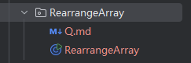

## 介绍

本仓库记录了我在学习算法过程中积累的一些高频的有趣的但不在我们常规刷题平台（如Leetcode）上的一些题目，其实只要掌握了算法和数据结构的基本知识点
辅助以刷题，达到举一反三的程度，做到融会贯通。


## 说明

应对算法面试和笔试，还是要按照常规的思路，刷好Leetcode hot100,剑指offer，程序员面试经典，左神的算法课程等，所以这个仓库中的题目
只给出了解题的基本题干，至于具体的数据范围，时间空间复杂度都不做要求，所以本仓库的题目只做分享和思路拓展。


**注意** 里面很多题干很长的题目大多数都是互联网企业笔试机试的题目，这一步题目难度较大，难度主要体现在

1. 题目题干很长，要求我们有分析问题和深入浅出的能力，做到透过表象看本质，所以将一个场景问题如何转换成为数据结构设计和算法处理问题是个需要不断练习的过程
2. AC严格的要求准确度和通过率，并且在规定时间内完成，有严格的数据大小和时间空间复杂度的要求
3. 因为刷题习惯的问题，我们在Leetcode中大部分题目都是很简短的问题表述，所以一旦融入情景就会比较困难


## 如何使用


#### 题目简短的类型 

这部分直接见代码的起始处的***注释***。

例如

```java
//大数相加    
public class BigNumberAddition {
    public static String addStrings(String num1, String num2) {
        StringBuilder result = new StringBuilder();
        int i = num1.length() - 1;
        int j = num2.length() - 1;
        int carry = 0;

        while (i >= 0 || j >= 0 || carry != 0) {
            int digit1 = i >= 0 ? num1.charAt(i) - '0' : 0;
            int digit2 = j >= 0 ? num2.charAt(j) - '0' : 0;

            int sum = digit1 + digit2 + carry;
            result.append(sum % 10);
            carry = sum / 10;

            i--;
            j--;
        }

        return result.reverse().toString();
    }

    public static void main(String[] args) {
        String num1 = "12345678901234567890";
        String num2 = "98765432109876543210";
        String sum = addStrings(num1, num2);
        System.out.println("Sum: " + sum);
    }
}    
```


#### 题目较长的类型

这部分的内容放在了每一个文件夹中。

```text
每一个文件夹中有代码文件和题目文件，其中题目文件使用 .md的格式
```

例如




## 说在最后

我自己也在不断学习算法的过程中，见的题目也不是很全面，所以如果你在刷题过程中也有很好的题目可以分享，那真是太好了，特别希望您能在[issues](https://github.com/iukkeopaa/CodeTopSummary/issues)中补充，十分感谢。

日拱一卒无有尽 功不唐捐终入海

一起加油吧


